# Lập trình Socket trên Linux

## Phần 1. Tổng quan

### 1.1. Độc lập giao thức (Protocol Independence)

Giao thức (protocol) là bộ quy tắc mà hai bên thống nhất để trao đổi dữ liệu, ví dụ IPv4, IPv6, TCP, UDP.

Một chương trình được gọi là **phụ thuộc giao thức** (protocol-dependent) khi mã nguồn bị gắn chặt vào một giao thức cụ thể. Ví dụ, một chương trình khách (client) viết cho IPv4 sẽ dùng:

```c
struct sockaddr_in servaddr;          // cấu trúc địa chỉ riêng của IPv4
servaddr.sin_family = AF_INET;
servaddr.sin_port   = htons(13);
inet_pton(AF_INET, "192.168.1.10", &servaddr.sin_addr);
sockfd = socket(AF_INET, SOCK_STREAM, 0);
```

Muốn chuyển sang IPv6, bạn phải sửa nhiều chỗ:

| IPv4          | IPv6           |
|---------------|----------------|
| `sockaddr_in` | `sockaddr_in6` |
| `AF_INET`     | `AF_INET6`     |
| `sin_port`    | `sin6_port`    |
| `sin_addr`    | `sin6_addr`    |

Mỗi lần đổi giao thức là một lần sửa mã nguồn.

**Độc lập giao thức** (protocol independence) là cách viết chương trình sao cho mã nguồn không bị gắn cứng vào một giao thức nào, chạy được với cả IPv4 lẫn IPv6 mà không cần sửa. Cách làm chuẩn là dùng hàm `getaddrinfo()`. Hàm này nhận vào tên máy (hostname) hoặc chuỗi địa chỉ, rồi tự trả về cấu trúc địa chỉ phù hợp (IPv4 hoặc IPv6) cùng với họ giao thức (domain) và kiểu socket (type) tương ứng. Chương trình chỉ việc dùng các giá trị trả về đó để gọi `socket()` và `connect()`, không cần biết bên dưới là giao thức nào.

Điều này khả thi vì bản thân giao diện lập trình socket (sockets API – tập hàm socket) được thiết kế từ đầu để hỗ trợ nhiều họ giao thức (protocol family) khác nhau. Các hàm như `bind()`, `connect()` nhận tham số kiểu chung `struct sockaddr *`, còn cấu trúc địa chỉ cụ thể thì thay đổi theo từng giao thức.

### 1.2. Mô hình OSI (OSI Model)

Mô hình OSI (Open Systems Interconnection – Kết nối các hệ thống mở) do tổ chức ISO đưa ra, chia quá trình truyền thông mạng thành 7 tầng. Mỗi tầng đảm nhận một nhiệm vụ riêng và chỉ làm việc với tầng ngay trên và ngay dưới nó.

| Tầng OSI                        | Tương ứng trong bộ giao thức Internet                   | Nằm ở đâu                     |
|---------------------------------|---------------------------------------------------------|-------------------------------|
| 7. Ứng dụng (Application)       | Ứng dụng (HTTP, FTP, chương trình của bạn…)             | Tiến trình người dùng (user process) |
| 6. Trình bày (Presentation)     | ↑ (gộp vào tầng ứng dụng)                               | ↑                             |
| 5. Phiên (Session)              | ↑ (gộp vào tầng ứng dụng)                               | ↑                             |
| 4. Vận chuyển (Transport)       | TCP, UDP                                                | Nhân hệ điều hành (kernel)    |
| 3. Mạng (Network)               | IPv4, IPv6                                              | Nhân hệ điều hành (kernel)    |
| 2. Liên kết dữ liệu (Data link) | Trình điều khiển thiết bị và phần cứng (ví dụ Ethernet) | Trình điều khiển + phần cứng  |
| 1. Vật lý (Physical)            | ↑                                                       | ↑                             |

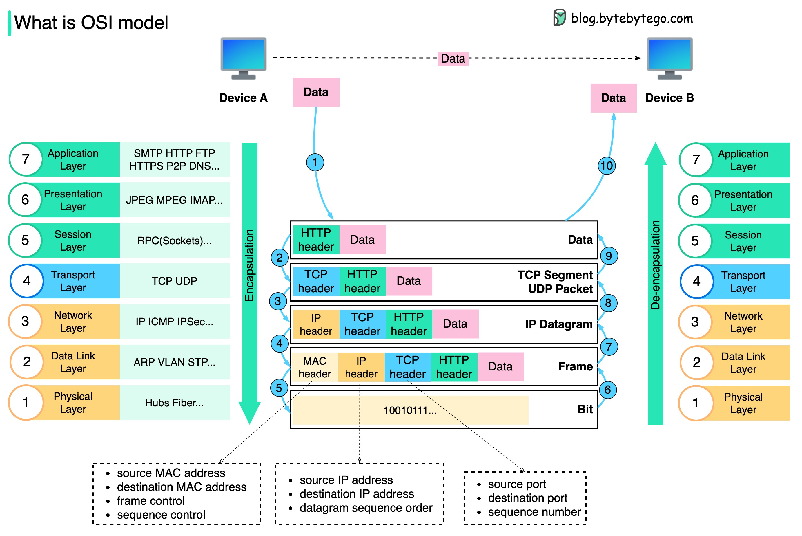

#### Dữ liệu được gửi qua mạng như thế nào? Tại sao mô hình OSI cần nhiều tầng như vậy?

Sơ đồ trên cho thấy dữ liệu được đóng gói (encapsulation) và mở gói (de-encapsulation) như thế nào khi truyền qua mạng.

1. **Bước 1:** Khi thiết bị A gửi dữ liệu đến thiết bị B qua mạng bằng giao thức HTTP, dữ liệu trước tiên được thêm một phần đầu HTTP (HTTP header) ở tầng ứng dụng.
2. **Bước 2:** Tiếp theo, một phần đầu TCP hoặc UDP được thêm vào dữ liệu. Dữ liệu được đóng gói thành các phân đoạn TCP (TCP segment) ở tầng vận chuyển. Phần đầu này chứa cổng nguồn, cổng đích và số thứ tự (sequence number).
3. **Bước 3:** Các phân đoạn sau đó được đóng gói thêm phần đầu IP ở tầng mạng. Phần đầu IP chứa địa chỉ IP nguồn và địa chỉ IP đích.
4. **Bước 4:** Gói tin IP (IP datagram) được thêm phần đầu MAC ở tầng liên kết dữ liệu, chứa địa chỉ MAC nguồn và địa chỉ MAC đích.
5. **Bước 5:** Các khung (frame) đã đóng gói được chuyển xuống tầng vật lý và truyền qua mạng dưới dạng các bit nhị phân.
6. **Bước 6–10:** Khi thiết bị B nhận các bit từ mạng, nó thực hiện quá trình mở gói, tức là làm ngược lại quá trình đóng gói. Các phần đầu được gỡ bỏ lần lượt qua từng tầng, và cuối cùng thiết bị B đọc được dữ liệu.

> Mô hình mạng cần chia tầng vì mỗi tầng chỉ tập trung vào trách nhiệm riêng của mình. Mỗi tầng dựa vào phần đầu (header) để biết cách xử lý, và không cần hiểu ý nghĩa của dữ liệu đến từ tầng khác.

### 1.3. Lịch sử mạng trên BSD (BSD Networking History)

BSD (Berkeley Software Distribution) là một nhánh hệ điều hành UNIX do nhóm CSRG (Computer Systems Research Group – Nhóm nghiên cứu hệ thống máy tính) tại Đại học California, Berkeley phát triển.

Các mốc chính:

| Năm        | Phiên bản                                   | Ý nghĩa |
|------------|---------------------------------------------|---------|
| 1983       | 4.2BSD                                      | Bản phát hành đầu tiên được phổ biến rộng rãi có giao diện lập trình socket và bộ giao thức TCP/IP. Đây là nơi giao diện lập trình socket ra đời. |
| 1986–1990  | 4.3BSD (1986), 4.3BSD Tahoe (1988), 4.3BSD Reno (1990) | Tiếp tục cải tiến mã mạng. |
| 1989, 1991 | Net/1, Net/2                                | Phát hành riêng phần mã mạng dưới dạng mã nguồn tự do, không cần giấy phép UNIX của AT&T. |
| 1993–1995  | 4.4BSD (1993), 4.4BSD-Lite / Net/3 (1994), 4.4BSD-Lite2 (1995) | Các bản phát hành cuối cùng của Berkeley. |

---

## Phần 2. Địa chỉ socket và thứ tự byte

### 2.1. Cấu trúc địa chỉ socket (Socket Address Structures)

- Một giao thức tầng vận chuyển trong bộ TCP/IP cần cả địa chỉ IP lẫn số cổng (port) ở mỗi đầu để tạo kết nối. Sự kết hợp giữa một địa chỉ IP và một số cổng được gọi là **địa chỉ socket** (socket address).
- Địa chỉ socket của máy khách xác định duy nhất tiến trình khách, cũng như địa chỉ socket của máy chủ xác định duy nhất tiến trình chủ, như minh họa trong hình.


- Để sử dụng dịch vụ của tầng vận chuyển trên Internet, ta cần một cặp địa chỉ socket: địa chỉ socket của máy khách và địa chỉ socket của máy chủ.
- Bốn thông tin này nằm trong phần đầu gói tin tầng mạng và phần đầu gói tin tầng vận chuyển. Phần đầu thứ nhất chứa các địa chỉ IP; phần đầu thứ hai chứa các số cổng.

**Vấn đề mới:** chỉ có một bộ hàm socket nhưng phải nhận được nhiều loại địa chỉ.

**Giải pháp:** mọi cấu trúc địa chỉ đều tuân theo một quy ước: trường đầu tiên luôn cho biết họ địa chỉ (family), kèm theo đó là độ dài của cấu trúc.

Nhân hệ điều hành nhận một khối byte, đọc trường đầu tiên để biết "đây là IPv4" hay "đây là IPv6", rồi mới biết cách hiểu các byte còn lại. Cấu trúc chung (`sockaddr`) chỉ là cái "khung" thể hiện quy ước này, không dùng để chứa địa chỉ thật. Đây cũng chính là điều giúp giao diện lập trình socket đạt được tính độc lập giao thức.

### 2.2. Tham số giá trị – kết quả (Value-Result Arguments)

Tiến trình và nhân hệ điều hành nằm ở hai vùng bộ nhớ tách biệt: **không gian người dùng** (user space – vùng nhớ của tiến trình) và **không gian nhân** (kernel space – vùng nhớ của nhân). Tiến trình không được đọc bộ nhớ của nhân. Vì vậy khi nhân muốn trả địa chỉ về (ví dụ "máy khách vừa kết nối đến có địa chỉ gì"), nó không thể đưa cho tiến trình một con trỏ vào bộ nhớ của nhân. Cách duy nhất: tiến trình chuẩn bị sẵn một vùng nhớ, nhân chép dữ liệu vào đó.

Từ đây sinh ra hai câu hỏi:

1. **Nhân được phép ghi bao nhiêu byte?** Nếu nhân ghi nhiều hơn vùng nhớ tiến trình cấp, dữ liệu sẽ tràn sang vùng khác (tràn bộ đệm – buffer overflow).
2. **Nhân thực sự đã ghi bao nhiêu byte?** Địa chỉ IPv4 và IPv6 có kích thước khác nhau, nên tiến trình cần biết kết quả thực tế dài bao nhiêu.

**Giải pháp:** dùng một biến độ dài cho cả hai vai trò, và tiến trình truyền địa chỉ của biến đó để nhân có thể sửa nó:

| Thời điểm   | Biến độ dài cho biết        |
|-------------|-----------------------------|
| Khi truyền vào | Kích thước vùng nhớ      |
| Khi trả về  | Số byte thực tế đã ghi      |

Cấu trúc địa chỉ socket được truyền từ nhân sang tiến trình:

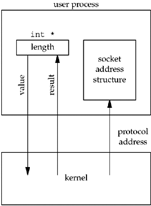

### 2.3. Thứ tự byte (Byte Ordering)


#### Thứ tự byte nhỏ trước (Little Endian)

Bộ xử lý Intel x86 lưu một số nguyên 2 byte theo cách: byte ít quan trọng nhất (byte thấp) đứng trước, tiếp theo là byte quan trọng nhất (byte cao). Cách này gọi là thứ tự byte **little-endian**.

#### Thứ tự byte lớn trước (Big Endian)

Trong thứ tự byte **big-endian**, byte quan trọng nhất được lưu ở địa chỉ bộ nhớ thấp nhất, còn byte ít quan trọng nhất được lưu ở địa chỉ bộ nhớ cao nhất. Các kiến trúc PowerPC đời cũ và Motorola 68k thường dùng big-endian. Trong truyền thông mạng và lưu trữ tệp, người ta cũng dùng big-endian.

Thứ tự byte trở nên quan trọng khi dữ liệu được truyền giữa các hệ thống, hoặc được xử lý bởi các hệ thống có thứ tự byte khác nhau. Cần xử lý thứ tự byte đúng cách để dữ liệu được hiểu nhất quán trên các hệ thống khác nhau.

Thứ tự mà CPU của một máy sử dụng gọi là **thứ tự byte của máy** (host byte order). Trong phạm vi một máy thì không có vấn đề gì, vì CPU ghi và đọc theo cùng một quy ước.

#### Vấn đề thật sự xuất hiện khi truyền qua mạng

Mạng chỉ truyền một chuỗi byte liên tiếp, không mang thông tin "byte này là byte cao hay byte thấp". Nếu máy gửi là little-endian gửi `90 1F`, máy nhận là big-endian sẽ đọc thành `0x901F` = 36895. Cùng một chuỗi byte nhưng hai bên hiểu thành hai số khác nhau.

#### Giải pháp

Các giao thức mạng thống nhất một quy ước chung: mọi trường số trong phần đầu gói tin đều dùng big-endian. Quy ước này gọi là **thứ tự byte mạng** (network byte order).

Từ đó sinh ra các **hàm chuyển đổi thứ tự byte** (byte ordering functions): chúng chuyển số từ thứ tự byte của máy sang thứ tự byte mạng khi gửi, và ngược lại khi nhận. Bản chất của các hàm này:

- Trên máy little-endian: chúng đảo thứ tự byte.
- Trên máy big-endian: chúng không làm gì cả, vì thứ tự của máy đã trùng với thứ tự mạng.

Nhờ vậy cùng một đoạn mã chạy đúng trên mọi loại CPU, lập trình viên không cần biết máy mình thuộc loại nào. Đây là **tính khả chuyển** (portability), tức mã nguồn chạy được trên nhiều nền tảng mà không phải sửa.

---

## Phần 3. Các hàm `inet_aton`, `inet_pton`, `inet_ntop`

Một địa chỉ IP tồn tại ở hai dạng:

- **Dạng văn bản** (presentation / text form): là chuỗi ký tự mà con người đọc và gõ được, ví dụ `"192.168.1.10"` (IPv4, gọi là dạng thập phân có dấu chấm – dotted-decimal, tức 4 số thập phân ngăn cách bởi dấu chấm) hoặc `"fe80::1"` (IPv6, dạng thập lục phân ngăn cách bởi dấu hai chấm).
- **Dạng nhị phân** (numeric / binary form): là giá trị số mà nhân hệ điều hành và phần đầu gói tin IP sử dụng. Với IPv4 là một số 32 bit, với IPv6 là 128 bit, theo thứ tự byte mạng. Đây là dạng được lưu trong trường địa chỉ của cấu trúc địa chỉ socket.

Hai dạng này hoàn toàn khác nhau trong bộ nhớ. Người dùng nhập chuỗi (từ tệp cấu hình, dòng lệnh), còn cấu trúc địa chỉ cần số nhị phân. Khi nhân trả về địa chỉ máy khách, bạn nhận được số nhị phân nhưng muốn in ra nhật ký (log) thì cần chuỗi. Vì vậy cần các hàm chuyển đổi qua lại giữa hai dạng.

### 3.1. `inet_aton` – chuỗi → nhị phân (chỉ IPv4)

```c
int inet_aton(const char *str, struct in_addr *addr);
```

- Chuyển chuỗi `str` thành số nhị phân và ghi vào `addr`.
- Trả về `1` nếu chuỗi hợp lệ, `0` nếu không hợp lệ.
- Hàm này khá "dễ dãi": ngoài dạng 4 phần chuẩn, nó còn chấp nhận các dạng rút gọn và số thập lục phân/bát phân (ví dụ `"10.1"` hay `"0x7f.1"`), điều này đôi khi gây bất ngờ.

### 3.2. `inet_pton` – chuỗi → nhị phân (cả IPv4 và IPv6)

```c
int inet_pton(int family, const char *str, void *addr);
```

| Tham số  | Ý nghĩa |
|----------|---------|
| `family` | `AF_INET` hoặc `AF_INET6`, cho hàm biết cần hiểu chuỗi theo kiểu nào |
| `str`    | Chuỗi địa chỉ |
| `addr`   | Nơi ghi kết quả. Với IPv4 là con trỏ tới `struct in_addr`, với IPv6 là con trỏ tới `struct in6_addr`. Kiểu `void *` cho phép nhận cả hai |

Giá trị trả về có ba trường hợp, và đây là điểm cải tiến so với `inet_addr`:

| Giá trị | Ý nghĩa |
|---------|---------|
| `1`     | Thành công |
| `0`     | Chuỗi không đúng định dạng của họ địa chỉ đã chọn |
| `-1`    | Lỗi, ví dụ họ địa chỉ không được hỗ trợ (`errno = EAFNOSUPPORT`) |

> Với `AF_INET`, hàm này nghiêm ngặt: chỉ chấp nhận dạng 4 số thập phân chuẩn, không nhận dạng rút gọn hay thập lục phân như `inet_aton`.

### 3.3. `inet_ntop` – nhị phân → chuỗi

```c
const char *inet_ntop(int family, const void *addr, char *str, socklen_t size);
```

| Tham số | Ý nghĩa |
|---------|---------|
| `addr`  | Con trỏ tới địa chỉ nhị phân (`in_addr` hoặc `in6_addr`) |
| `str`   | Vùng nhớ do bạn cấp để hàm ghi chuỗi vào |
| `size`  | Kích thước vùng nhớ đó, để hàm không ghi tràn. Nếu vùng nhớ quá nhỏ, hàm trả về `NULL` và đặt `errno = ENOSPC` |

**Trả về:** con trỏ `str` nếu thành công, `NULL` nếu lỗi.

---

## Phần 4. Các hàm socket cơ bản

Các hàm được đề cập: `socket`, `connect`, `bind`, `listen`, `accept`.

Trình tự gọi hàm của một cặp client/server TCP như sau:

```text
        SERVER                                   CLIENT
   socket()                                 socket()
      │                                        │
   bind()      ← gắn IP:port "nổi tiếng"       │  (thường không bind, nhân tự chọn cổng tạm)
      │                                        │
   listen()    ← CLOSED → LISTEN               │
      │                                        │
   accept()    ← chặn, chờ kết nối       connect()  ← gửi SYN, bắt tay 3 bước
      │  ◄──────────── bắt tay 3 bước ─────────┤
      │  trả về socket MỚI (connfd)            │  trả về 0 khi đã ESTABLISHED
   read/write  ◄────────── dữ liệu ──────────► write/read
   close()                                  close()
```

### 4.1. `socket()`: tạo một điểm cuối truyền thông

```c
#include <sys/socket.h>

int socket(int family, int type, int protocol);
```

| Tham số    | Ý nghĩa                 | Giá trị thường dùng |
|------------|-------------------------|---------------------|
| `family`   | Họ giao thức (domain)   | `AF_INET` (IPv4), `AF_INET6` (IPv6), `AF_LOCAL`/`AF_UNIX` (socket nội bộ trong máy), `AF_ROUTE`, `AF_KEY` |
| `type`     | Kiểu socket             | `SOCK_STREAM` (luồng byte), `SOCK_DGRAM` (gói tin), `SOCK_SEQPACKET`, `SOCK_RAW` |
| `protocol` | Giao thức cụ thể        | `0` để nhân tự chọn giao thức mặc định cho cặp family/type, hoặc `IPPROTO_TCP`, `IPPROTO_UDP`, `IPPROTO_SCTP` |

Các tổ hợp hợp lệ thường gặp:

|               | `AF_INET` | `AF_INET6` |
|---------------|-----------|------------|
| `SOCK_STREAM` | TCP       | TCP        |
| `SOCK_DGRAM`  | UDP       | UDP        |
| `SOCK_RAW`    | IPv4 thô  | IPv6 thô   |

**Giá trị trả về:** một số nguyên không âm gọi là bộ mô tả socket (socket descriptor, `sockfd`), giống như bộ mô tả tệp (file descriptor). Trả về `-1` nếu lỗi và đặt `errno`.

**Bản chất:**

- `socket()` chỉ tạo ra một cấu trúc dữ liệu trong nhân và cho biết socket sẽ dùng giao thức nào. Socket lúc này **chưa có địa chỉ** (chưa có IP và cổng cục bộ), cũng **chưa kết nối** tới ai.
- Vì socket cũng là một descriptor nên sau này có thể dùng `read()`, `write()`, `close()` như với tệp.
- Nếu kết hợp với `getaddrinfo()` (Phần 1), ta truyền thẳng `ai_family`, `ai_socktype`, `ai_protocol` vào `socket()`, nên mã nguồn không phụ thuộc vào giao thức.

### 4.2. `connect()`: client thiết lập kết nối tới server

```c
int connect(int sockfd, const struct sockaddr *servaddr, socklen_t addrlen);
```

| Tham số    | Ý nghĩa |
|------------|---------|
| `sockfd`   | Socket do `socket()` trả về |
| `servaddr` | Con trỏ tới cấu trúc địa chỉ socket của server (IP + cổng). Kiểu chung `struct sockaddr *` nên phải ép kiểu: `(struct sockaddr *) &servaddr` |
| `addrlen`  | Kích thước của cấu trúc đó, ví dụ `sizeof(servaddr)`. Đây là tham số truyền giá trị (từ tiến trình vào nhân), **không phải** tham số giá trị–kết quả |

**Trả về:** `0` nếu thành công, `-1` nếu lỗi.

**Bản chất với TCP:** `connect()` kích hoạt bắt tay 3 bước (three-way handshake) và chỉ trả về khi kết nối đã thiết lập (`ESTABLISHED`) hoặc khi có lỗi.

- Client không cần gọi `bind()` trước. Nếu chưa bind, nhân sẽ tự chọn IP nguồn (theo tuyến đường ra) và một cổng tạm (ephemeral port).
- Trạng thái TCP chuyển từ `CLOSED` sang `SYN_SENT`, rồi sang `ESTABLISHED` khi nhận được SYN+ACK.

Ba lỗi kinh điển:

| Tình huống | Lỗi | Giải thích |
|------------|-----|------------|
| Không nhận được phản hồi cho SYN (gửi lại nhiều lần, tổng khoảng 75 giây) | `ETIMEDOUT` | Server tắt máy, IP không tồn tại trong mạng LAN… |
| Server trả về RST | `ECONNREFUSED` | **Hard error** (lỗi cứng): máy server có tồn tại nhưng không có tiến trình nào lắng nghe ở cổng đó |
| Router trung gian trả về ICMP "destination unreachable" | `EHOSTUNREACH` / `ENETUNREACH` | **Soft error** (lỗi mềm): nhân vẫn thử lại, sau khoảng 75 giây mới báo lỗi |

> **Lưu ý quan trọng:** nếu `connect()` thất bại, socket đó không dùng lại được nữa. Phải `close()` rồi gọi `socket()` lại. Đây là lý do vòng lặp thử từng địa chỉ trả về từ `getaddrinfo()` luôn tạo socket mới cho mỗi lần thử.

### 4.3. `bind()`: gắn địa chỉ cục bộ cho socket

```c
int bind(int sockfd, const struct sockaddr *myaddr, socklen_t addrlen);
```

| Tham số   | Ý nghĩa |
|-----------|---------|
| `myaddr`  | Địa chỉ cục bộ (IP + cổng của chính máy mình) muốn gắn vào socket |
| `addrlen` | Kích thước cấu trúc (tham số truyền giá trị) |

**Trả về:** `0` nếu thành công, `-1` nếu lỗi.

**Tại sao cần?** Server phải có một cổng cố định, được biết trước (well-known port, ví dụ 80 cho HTTP, 13 cho daytime) để client biết mà kết nối tới. Client thường không cần, vì chỉ dùng cổng tạm.

Bốn cách kết hợp IP và cổng khi bind:

| Địa chỉ IP | Cổng | Kết quả |
|------------|------|---------|
| Wildcard (`INADDR_ANY` / `in6addr_any`) | `0` | Nhân chọn cả IP lẫn cổng |
| Wildcard | khác `0` | Nhân chọn IP, tiến trình chọn cổng. **Đây là cách phổ biến nhất ở server** |
| IP cụ thể | `0` | Tiến trình chọn IP, nhân chọn cổng |
| IP cụ thể | khác `0` | Tiến trình chọn cả hai |

- Địa chỉ wildcard (`INADDR_ANY`) có nghĩa là "nhận kết nối đến bất kỳ IP nào của máy này". Máy có nhiều card mạng thì server nhận kết nối trên tất cả card đó.
- Nếu IP cụ thể thì server chỉ nhận kết nối gửi tới đúng IP đó.
- Nếu để nhân chọn cổng (cổng = 0), `bind()` không trả về cổng đã chọn (vì `myaddr` là `const`). Muốn biết cổng đó phải gọi `getsockname()`.

Ví dụ điển hình:

```c
struct sockaddr_in servaddr;
memset(&servaddr, 0, sizeof(servaddr));
servaddr.sin_family      = AF_INET;
servaddr.sin_addr.s_addr = htonl(INADDR_ANY);   // chuyển sang thứ tự byte mạng (Phần 2)
servaddr.sin_port        = htons(13);
bind(listenfd, (struct sockaddr *) &servaddr, sizeof(servaddr));
```

> **Lỗi hay gặp:** `EADDRINUSE` ("Address already in use"). Thường xảy ra khi khởi động lại server ngay sau khi tắt, lúc kết nối cũ vẫn đang ở trạng thái `TIME_WAIT`. Cách khắc phục là đặt tùy chọn `SO_REUSEADDR` bằng `setsockopt()` trước khi gọi `bind()`. Ngoài ra, bind cổng < 1024 trên UNIX cần quyền root (`EACCES`).

### 4.4. `listen()`: chuyển socket sang chế độ lắng nghe

```c
int listen(int sockfd, int backlog);
```

**Trả về:** `0` nếu thành công, `-1` nếu lỗi. Chỉ server gọi hàm này.

Hàm làm hai việc:

1. **Biến socket chủ động thành socket bị động.** Mặc định, socket tạo bởi `socket()` được coi là chủ động (active), tức là socket client sẽ gọi `connect()`. `listen()` báo cho nhân biết socket này dùng để chấp nhận kết nối đến. Trạng thái TCP chuyển từ `CLOSED` sang `LISTEN`.
2. **Quy định `backlog`:** số lượng tối đa kết nối mà nhân xếp hàng chờ cho socket này.

Hai hàng đợi mà nhân duy trì cho socket lắng nghe:

```text
 Client gửi SYN
      │
      ▼
┌────────────────────────────────┐   Nhân gửi SYN+ACK, chờ ACK
│ Hàng đợi kết nối CHƯA HOÀN TẤT │   (trạng thái SYN_RCVD)
│ (incomplete connection queue)  │
└────────────────────────────────┘
      │ nhận ACK (bắt tay 3 bước xong)
      ▼
┌────────────────────────────────┐   Trạng thái ESTABLISHED,
│ Hàng đợi kết nối ĐÃ HOÀN TẤT   │   chờ tiến trình gọi accept()
│ (completed connection queue)   │
└────────────────────────────────┘
      │ accept()
      ▼
   Tiến trình server nhận socket mới
```

- **Điểm quan trọng:** bắt tay 3 bước do nhân tự làm, không phụ thuộc vào việc server có đang gọi `accept()` hay không. `accept()` chỉ lấy ra kết nối đã hoàn tất.
- `backlog` (trên Linux hiện nay) là giới hạn của hàng đợi đã hoàn tất. Giá trị bị chặn bởi `/proc/sys/net/core/somaxconn`. Có thể dùng hằng `SOMAXCONN`.

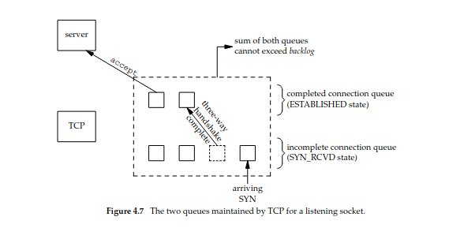

- Khi hàng đợi đầy mà có SYN mới đến, TCP **bỏ qua** SYN đó (không gửi RST). Client sẽ tự gửi lại SYN và có cơ hội được nhận sau. Nếu gửi RST, client sẽ hiểu nhầm là "không có server" (`ECONNREFUSED`).
- Không nên đặt `backlog = 0`, vì mỗi hệ thống hiểu giá trị này khác nhau.

### 4.5. `accept()`: lấy một kết nối đã hoàn tất ra khỏi hàng đợi

```c
int accept(int sockfd, struct sockaddr *cliaddr, socklen_t *addrlen);
```

| Tham số   | Ý nghĩa |
|-----------|---------|
| `sockfd`  | Socket lắng nghe (listening socket) đã qua `bind()` và `listen()` |
| `cliaddr` | Vùng nhớ do tiến trình cấp, nhân sẽ ghi địa chỉ của client vào đây |
| `addrlen` | Tham số giá trị–kết quả (value-result argument, xem [Phần 2.2](#22-tham-số-giá-trị--kết-quả-value-result-arguments)) |

Với `addrlen`:

- Khi truyền vào: `*addrlen` = kích thước vùng nhớ `cliaddr`.
- Khi trả về: `*addrlen` = số byte nhân thực sự đã ghi.
- Nếu không cần biết địa chỉ client, có thể truyền `NULL` cho cả `cliaddr` và `addrlen`.

**Trả về:** một bộ mô tả socket **MỚI**, gọi là socket đã kết nối (connected socket, `connfd`). Trả về `-1` nếu lỗi.

Phân biệt hai loại socket (điểm dễ nhầm nhất):

|           | Socket lắng nghe (`listenfd`)          | Socket đã kết nối (`connfd`) |
|-----------|----------------------------------------|------------------------------|
| Tạo bởi   | `socket()` + `bind()` + `listen()`     | `accept()` |
| Số lượng  | Một cho cả vòng đời server             | Một cho mỗi client |
| Dùng để   | Chỉ để nhận kết nối mới                | `read()`/`write()` dữ liệu với đúng một client |
| Đóng khi  | Server tắt                             | Phục vụ xong client đó |

- **Hành vi chặn (blocking):** nếu hàng đợi đã hoàn tất đang rỗng, tiến trình bị ngủ (sleep) cho tới khi có kết nối mới.
- Mỗi kết nối TCP được xác định bởi bộ 4 giá trị (IP client, cổng client, IP server, cổng server). Vì vậy nhiều `connfd` có thể dùng chung cổng server (ví dụ 13) mà không bị lẫn nhau.

---

## Phần 5. Server đồng thời (Concurrent Servers)

**Vấn đề:** server lặp (iterative server) phục vụ từng client một. Nếu một client giữ kết nối lâu, các client khác phải nằm chờ trong hàng đợi accept.

**Giải pháp:** sau mỗi lần `accept()`, gọi `fork()` để tạo một tiến trình con phục vụ riêng client đó. Tiến trình cha quay lại `accept()` ngay.

### 5.1. `fork()`

```c
pid_t fork(void);
```

Hàm được gọi **một lần** nhưng trả về **hai lần**:

| Trả về ở      | Giá trị |
|---------------|---------|
| Tiến trình cha | PID của con (`> 0`) |
| Tiến trình con | `0` |
| Lỗi           | `-1` |

Con là bản sao của cha và dùng chung các socket đã mở trước `fork()`: cả hai cùng trỏ tới một socket trong nhân.

### 5.2. Khung chương trình

```c
for (;;) {
    connfd = accept(listenfd, ...);
    if (fork() == 0) {          // con
        close(listenfd);
        doit(connfd);
        close(connfd);
        exit(0);
    }
    close(connfd);              // cha
}
```

### 5.3. Tại sao phải `close()` ở cả hai phía?

Mỗi socket có một **bộ đếm tham chiếu** (reference count). `close()` chỉ giảm bộ đếm đi 1; nhân chỉ thật sự đóng socket (gửi FIN) khi bộ đếm về 0. Sau `fork()`, cả `listenfd` và `connfd` đều có bộ đếm bằng 2.

| Quên đóng | Hậu quả |
|-----------|---------|
| Cha không `close(connfd)` | Rò rỉ descriptor (sau một thời gian `accept()` báo `EMFILE`), và client không bao giờ nhận được FIN |
| Con không `close(listenfd)` | Con giữ cổng lắng nghe không cần thiết |

### 5.4. Ưu và nhược điểm

| Ưu điểm | Nhược điểm |
|---------|------------|
| Mã đơn giản, mỗi con chỉ lo một client | `fork()` tốn chi phí |
| Một con bị lỗi không ảnh hưởng tới các client khác | Mỗi kết nối tốn một tiến trình, khó mở rộng lên số lượng lớn |

---

## Phần 6. Các hàm `close`, `getsockname`, `getpeername`

### 6.1. `close()`: đóng socket

```c
#include <unistd.h>

int close(int sockfd);
```

**Trả về:** `0` nếu thành công, `-1` nếu lỗi.

**Bản chất với TCP:**

- `close()` đánh dấu descriptor là đã đóng và trả về ngay. Từ đó tiến trình không được dùng descriptor này để `read()`/`write()` nữa.
- Nhân vẫn cố gửi hết dữ liệu còn trong bộ đệm gửi, sau đó mới gửi FIN để bắt đầu quá trình kết thúc kết nối TCP bình thường.
- `close()` chỉ giảm bộ đếm tham chiếu đi 1. Nhân chỉ gửi FIN khi bộ đếm về 0 (xem [Phần 5.3](#53-tại-sao-phải-close-ở-cả-hai-phía)).

Khi cần hành vi khác:

| Cần | Dùng |
|-----|------|
| Gửi FIN ngay, bất kể bộ đếm tham chiếu | `shutdown(sockfd, SHUT_WR)` |
| Đóng một chiều: ngừng gửi nhưng vẫn đọc được | `shutdown(sockfd, SHUT_WR)` |
| `close()` chặn cho tới khi dữ liệu được gửi xong, hoặc hủy kết nối bằng RST | Tùy chọn `SO_LINGER` |

### 6.2. `getsockname()` và `getpeername()`

```c
#include <sys/socket.h>

int getsockname(int sockfd, struct sockaddr *localaddr, socklen_t *addrlen);
int getpeername(int sockfd, struct sockaddr *peeraddr,  socklen_t *addrlen);
```

| Hàm             | Trả về địa chỉ nào |
|-----------------|--------------------|
| `getsockname()` | Địa chỉ cục bộ (IP + cổng của chính mình) gắn với socket |
| `getpeername()` | Địa chỉ đầu bên kia (IP + cổng của máy đối diện) |

- `addrlen` là tham số giá trị–kết quả, giống `accept()`. Khi truyền vào, nó là kích thước vùng nhớ; khi trả về, nó là số byte nhân đã ghi.
- **Trả về:** `0` nếu thành công, `-1` nếu lỗi. `getpeername()` trên socket chưa kết nối báo lỗi `ENOTCONN`.

Khi nào cần dùng:

| Tình huống | Hàm | Lý do |
|------------|-----|-------|
| Client gọi `connect()` mà không `bind()` | `getsockname()` | Biết IP và cổng tạm mà nhân đã chọn |
| `bind()` với cổng 0 | `getsockname()` | Biết nhân đã chọn cổng nào (`bind()` không trả về giá trị này) |
| Server bind địa chỉ wildcard (`INADDR_ANY`) | `getsockname(connfd, ...)` sau `accept()` | Biết client đã kết nối tới IP nào của máy (khi máy có nhiều card mạng) |
| Chưa biết họ địa chỉ của một socket | `getsockname()` với `struct sockaddr_storage` | Đọc trường `ss_family` để biết đó là `AF_INET` hay `AF_INET6` |
| Tiến trình con được tạo bằng `fork()` rồi `exec()` sang chương trình khác (ví dụ `inetd`) | `getpeername()` | Sau `exec()`, chương trình mới chỉ còn descriptor, đã mất biến `cliaddr` mà `accept()` điền. Chỉ còn cách hỏi nhân địa chỉ client |

Ví dụ: in cổng tạm của client sau khi kết nối:

```c
struct sockaddr_in local;
socklen_t len = sizeof(local);
getsockname(sockfd, (struct sockaddr *) &local, &len);
printf("Cổng cục bộ: %d\n", ntohs(local.sin_port));
```

---

## Phần 7. TCP Echo Server và Client (`str_echo` / `str_cli`)

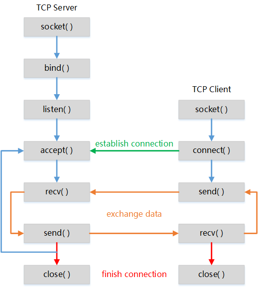

Đây là mô hình TCP client–server cơ bản: client gửi dữ liệu tới server, server nhận rồi gửi lại đúng dữ liệu đó cho client.

| Hàm | Chạy ở | Nhiệm vụ |
|-----|--------|----------|
| `str_cli()` | Client | Đọc một dòng từ `stdin`, gửi qua socket, đọc phản hồi từ server rồi in ra `stdout` |
| `str_echo()` | Server (tiến trình con) | Đọc dữ liệu từ connected socket rồi ghi trả lại cho client |

Qua ví dụ này có thể quan sát trọn luồng xử lý của một kết nối TCP:

1. Client gọi `connect()`, server nhận kết nối bằng `accept()`.
2. Server `fork()` một tiến trình con để chạy `str_echo()` (xem [Phần 5](#phần-5-server-đồng-thời-concurrent-servers)).
3. Hai bên trao đổi dữ liệu bằng `read()` / `write()`.
4. TCP truyền dữ liệu dưới dạng **luồng byte** (byte stream) giữa hai tiến trình, không giữ ranh giới giữa các lần ghi, nên chương trình phải tự xử lý việc đọc/ghi thiếu byte.

---

## Phần 8. Kết thúc kết nối, tín hiệu `SIGPIPE` và các kịch bản sự cố

### 8.1. Kết thúc bình thường (Normal Termination)

Sơ đồ máy trạng thái (state machine) của một kết nối TCP:

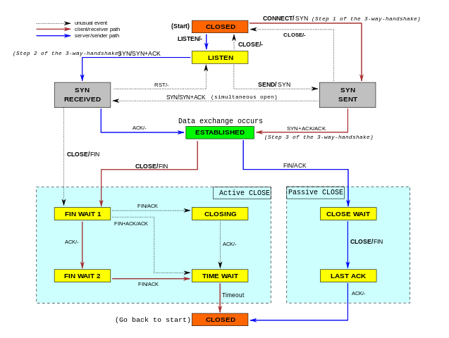

| # | Trạng thái | Ý nghĩa |
|---|------------|---------|
| 1 | `LISTEN` | Chờ yêu cầu kết nối từ bất kỳ máy TCP nào |
| 2 | `SYN-SENT` | Đã gửi yêu cầu kết nối (SYN), đang chờ yêu cầu kết nối tương ứng từ bên kia |
| 3 | `SYN-RECEIVED` | Đã gửi và nhận yêu cầu kết nối, đang chờ ACK xác nhận |
| 4 | `ESTABLISHED` | Kết nối đã mở, dữ liệu nhận được sẽ chuyển lên ứng dụng |
| 5 | `FIN-WAIT-1` | Đã gửi FIN, chờ ACK cho FIN đó hoặc chờ FIN từ bên kia |
| 6 | `FIN-WAIT-2` | FIN đã được ACK, chờ FIN từ bên kia |
| 7 | `CLOSE-WAIT` | Đã nhận FIN từ bên kia, chờ ứng dụng cục bộ gọi `close()` |
| 8 | `CLOSING` | Hai bên cùng gửi FIN, chờ ACK cho FIN của mình |
| 9 | `LAST-ACK` | Đã nhận FIN và đã gửi FIN của mình, chờ ACK cuối cùng |
| 10 | `TIME-WAIT` | Chờ đủ lâu (2 × MSL) để chắc chắn bên kia đã nhận ACK cuối |
| 11 | `CLOSED` | Trạng thái "giả định", biểu thị không có kết nối nào |

Trình tự các segment khi kết thúc kết nối:


### 8.2. Tín hiệu `SIGPIPE`

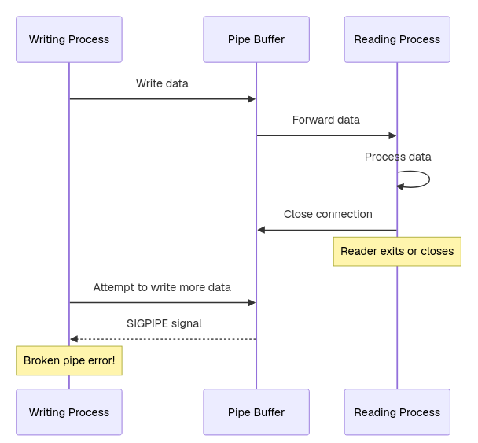

**Diễn biến:**

1. Client chạy bình thường, gửi `"hi there"`, server echo lại.
2. Tiến trình con của server bị kill. Nhân phía server gửi FIN cho client.
3. Người dùng nhập `"bye"` ở client.
4. Lần `writen()` thứ nhất gửi byte đầu tiên. Việc này hợp lệ vì socket mới chỉ nhận FIN.
5. TCP phía server không còn tiến trình nào giữ socket nên phản hồi bằng **RST**.
6. Client gọi `writen()` lần thứ hai trên socket đã nhận RST.
7. Nhân gửi tín hiệu `SIGPIPE` cho tiến trình client. Hành động mặc định của `SIGPIPE` là kết thúc tiến trình, shell in ra:

```
Broken pipe
```

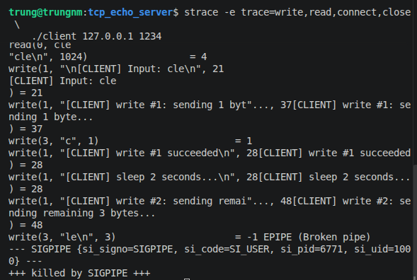

**Nguyên nhân:**

- Lần ghi **thứ nhất** khiến server gửi RST.
- Lần ghi **thứ hai** mới khiến tiến trình nhận `SIGPIPE`.

> **Quy tắc:** ghi dữ liệu vào socket đã nhận **FIN** là hợp lệ; ghi dữ liệu vào socket đã nhận **RST** là lỗi.

Nếu chương trình bỏ qua hoặc bắt `SIGPIPE`, `write()` sẽ trả về `-1` với `errno = EPIPE` thay vì làm chết tiến trình.

### 8.3. Các kịch bản server/client gặp sự cố

#### Máy server bị sập (Crash of Server Host)

**Tình huống:** client và server đang có một kết nối TCP. Bất ngờ **toàn bộ máy** server bị sập (mất điện, rút cáp mạng, kernel panic...), chứ không chỉ tiến trình server bị tắt.

**Điểm mấu chốt:** máy sập thì không kịp gửi FIN hay RST, nên client không nhận được thông báo nào.

| Sự cố | Client có biết ngay không? | Lý do |
|-------|---------------------------|-------|
| Chỉ **tiến trình** server chết | Có | Nhân server vẫn chạy, tự đóng socket và gửi FIN |
| Cả **máy** server sập | Không | Không có gì được gửi đi |

**Diễn biến ở phía client:**

1. Client gọi `write()` / `send()`. Lệnh thành công vì dữ liệu chỉ mới được chép vào bộ đệm gửi của nhân phía client.
2. TCP của client gửi segment đi nhưng không có ACK trả về.
3. TCP truyền lại nhiều lần, khoảng cách giữa các lần tăng gấp đôi (exponential backoff).
4. Trong suốt thời gian này, client bị chặn (block) ở `read()`.
5. Khi TCP bỏ cuộc (theo Stevens khoảng 9 phút trên BSD; trên Linux thường khoảng 15 phút trở lên, phụ thuộc tham số `tcp_retries2`), `read()` trả về lỗi:

| Lỗi | Khi nào |
|-----|---------|
| `ETIMEDOUT` | Hết thời gian mà không có phản hồi nào |
| `EHOSTUNREACH` / `ENETUNREACH` | Một router trung gian gửi về thông báo ICMP "không đến được đích" |

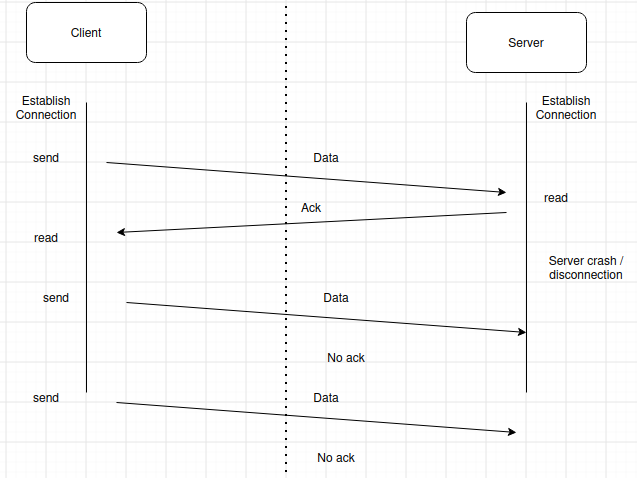

**Cách phát hiện sớm:** nếu client chỉ đọc mà không gửi gì, nó sẽ không bao giờ phát hiện server đã sập (xem [trường hợp 1b](#trường-hợp-1-read-khi-bên-kia-mất-mạng)). Các giải pháp:

- Đặt timeout cho `read()` (tùy chọn `SO_RCVTIMEO`, hoặc dùng `select()` / `poll()`).
- Bật `SO_KEEPALIVE`: sau một thời gian im lặng, TCP tự gửi gói thăm dò để kiểm tra bên kia còn sống không.
- Tự cài heartbeat ở tầng ứng dụng.

#### Máy server sập rồi khởi động lại (Crashing and Rebooting of Server Host)

1. Client và server đang có kết nối TCP, đã trao đổi dữ liệu bình thường.
2. Máy server sập và khởi động lại. Client không biết gì, vì máy sập không gửi FIN hay RST.
3. Trạng thái kết nối nằm trong RAM, nên sau khi reboot server mất toàn bộ thông tin về kết nối cũ. Với server, kết nối đó chưa từng tồn tại.
4. Client gửi một dòng dữ liệu, segment tới server.
5. TCP của server nhận segment thuộc về một kết nối nó không biết, nên trả lời bằng **RST**.
6. Client đang block ở `read()` nhận RST, `read()` trả về lỗi `ECONNRESET`.

#### Trường hợp 1: `read()` khi bên kia mất mạng

Dễ hiểu nhầm ở đây: `read()` không gửi dữ liệu nên không có chuyện chờ ACK. `read()` chỉ chờ dữ liệu từ bên kia tới. Kết quả phụ thuộc vào việc trước đó máy mình còn dữ liệu đã gửi mà chưa được ACK hay không.

**1a. Trước đó đã `write()` dữ liệu và chưa nhận ACK:**

- TCP giữ dữ liệu trong bộ đệm gửi và truyền lại nhiều lần, khoảng cách tăng dần.
- Trong lúc đó `read()` bị block.
- Khi TCP hết số lần truyền lại (Linux: `tcp_retries2`, mặc định 15 lần), nhân đánh dấu lỗi cho socket.
- `read()` trả về `-1` với `errno = ETIMEDOUT`.

**1b. Chỉ đọc, chưa gửi gì:**

- Không có dữ liệu nào cần truyền lại, nên TCP không gửi gì lên mạng và không phát hiện được bất thường.
- `read()` block mãi mãi, không có lỗi.
- Đây chính là lý do cần `SO_KEEPALIVE`, timeout của `select()` / `poll()`, hoặc heartbeat ở tầng ứng dụng.

#### Trường hợp 2: `write()` khi bên kia đã mất mạng

**Điểm mấu chốt:** `write()` trả về thành công **không** có nghĩa là bên kia đã nhận. `write()` chỉ chép dữ liệu vào bộ đệm gửi của nhân rồi trả về ngay.

1. `write()` lần đầu thành công (trả về số byte đã ghi), dù bên kia đã mất mạng.
2. TCP gửi dữ liệu, không có ACK, rồi truyền lại nhiều lần.
3. Nếu chương trình tiếp tục `write()` đến khi bộ đệm gửi đầy, `write()` bắt đầu block (hoặc trả về `EAGAIN` nếu socket ở chế độ non-blocking).
4. Khi TCP bỏ cuộc, socket ghi nhận lỗi `ETIMEDOUT`. Lỗi này được báo ở lần gọi `read()` / `write()` **kế tiếp**, không phải ở lần `write()` đã gửi dữ liệu đó.
5. Sau khi socket đã có lỗi, `write()` tiếp theo gây tín hiệu `SIGPIPE` (mặc định làm chương trình kết thúc). Nếu bỏ qua `SIGPIPE` thì `write()` trả về lỗi `EPIPE`.

---

## Phần 9. UDP: `recvfrom` / `sendto`, UDP Echo Server/Client, mất datagram

### 9.1. `recvfrom()` và `sendto()`

**Mô hình kiến trúc UDP:**

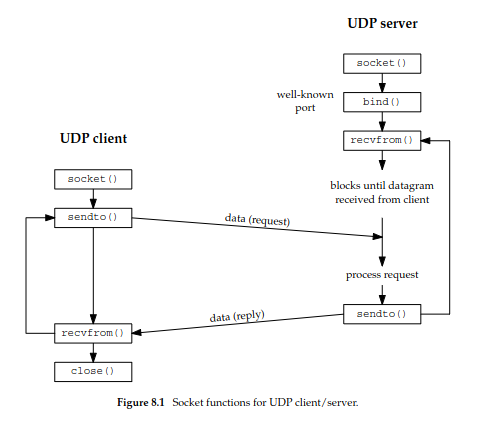

Điểm quan trọng nhất: UDP **không** có bước `connect()` / `accept()` như TCP. Thay vào đó UDP dùng hai hàm riêng để gửi và nhận dữ liệu:

```c
#include <sys/socket.h>

ssize_t recvfrom(int sockfd, void *buff, size_t nbytes, int flags,
                 struct sockaddr *from, socklen_t *addrlen);

ssize_t sendto(int sockfd, const void *buff, size_t nbytes, int flags,
               const struct sockaddr *to, socklen_t addrlen);
```

**Trả về:** số byte đã đọc/ghi nếu thành công, `-1` nếu lỗi.

| | TCP | UDP |
|---|-----|-----|
| Client | `connect()` rồi `write()` | Gửi thẳng datagram bằng `sendto()`, kèm địa chỉ server |
| Server | `accept()` rồi `read()` | Gọi `recvfrom()`, chờ datagram từ bất kỳ client nào |

`recvfrom()` trả về cả **datagram** lẫn **địa chỉ giao thức** của client đã gửi, nhờ đó server biết phải gửi phản hồi về đâu.

#### Tham số `to` của `sendto()`

`to` là cấu trúc địa chỉ socket chứa địa chỉ đích (IP + cổng) mà datagram sẽ được gửi tới. Kích thước cấu trúc được truyền qua `addrlen`.

```c
sendto(sockfd, buf, len, 0,
       (struct sockaddr *) &server_addr, sizeof(server_addr));
```

```
server_addr
    ├── IP address
    └── Port
```

#### Tham số `from` của `recvfrom()`

`recvfrom()` điền vào cấu trúc mà `from` trỏ tới địa chỉ giao thức của bên đã gửi datagram.

```c
struct sockaddr_in client_addr;
socklen_t addrlen = sizeof(client_addr);

recvfrom(sockfd, buf, sizeof(buf), 0,
         (struct sockaddr *) &client_addr, &addrlen);
```

Sau khi `recvfrom()` trả về:

```
client_addr
    ├── IP của client
    └── Port của client
```

- Server biết được datagram đến từ client nào.
- `addrlen` là tham số giá trị–kết quả (xem [Phần 2.2](#22-tham-số-giá-trị--kết-quả-value-result-arguments)): khi trả về, nó chứa số byte thực tế nhân đã ghi vào `client_addr`.

### 9.2. UDP Echo Server/Client

**Mô hình kiến trúc:**

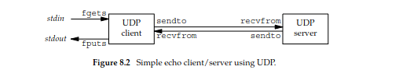

**Không có EOF:** UDP là giao thức phi kết nối (connectionless), nên không có khái niệm EOF như TCP. Với TCP, khi bên kia đóng kết nối, `read()` trả về `0`. UDP không có kết nối để đóng, vì vậy server không thể dựa vào EOF để thoát vòng lặp.

**Server lặp (iterative), không phải server đồng thời:** không có lời gọi `fork()`, một tiến trình server duy nhất xử lý tất cả client.

| Loại server | Thường là |
|-------------|-----------|
| TCP | Đồng thời (concurrent) |
| UDP | Lặp (iterative) |

```c
for (;;) {
    n = recvfrom(sockfd, buf, MAXLINE, 0, (struct sockaddr *) &cliaddr, &len);
    sendto(sockfd, buf, n, 0, (struct sockaddr *) &cliaddr, len);
}
```

```
Client A ──┐
           │
Client B ──┼──> UDP Server Process
           │
Client C ──┘
```

Server xử lý từng datagram lần lượt.

#### Bộ đệm nhận của socket UDP

Mỗi socket UDP có một **bộ đệm nhận** (receive buffer), đóng vai trò hàng đợi ngầm (implied queuing). Mỗi datagram đến socket được đặt vào bộ đệm này; mỗi lần gọi `recvfrom()`, datagram kế tiếp được trả về theo thứ tự **FIFO** (First In, First Out).

Khi có nhiều datagram đổ về cùng lúc, có thể tăng kích thước bộ đệm nhận:

1. Đọc giá trị hiện tại bằng `getsockopt(..., SO_RCVBUF, ...)`.
2. Đặt giá trị lớn hơn bằng `setsockopt(..., SO_RCVBUF, ...)` (xem [Phần 10.1](#101-getsockopt-và-setsockopt)).

Giá trị đặt không được vượt quá mức trần của hệ thống; nếu vượt, nhân tự giới hạn lại bằng mức trần.

```bash
# Kích thước bộ đệm nhận tối đa cho phép (trần hệ thống)
sysctl net.core.rmem_max

# Kích thước bộ đệm nhận mặc định khi tạo socket (nếu không gọi setsockopt)
sysctl net.core.rmem_default
```

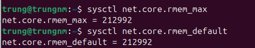

### 9.3. Mất datagram (Lost Datagrams)

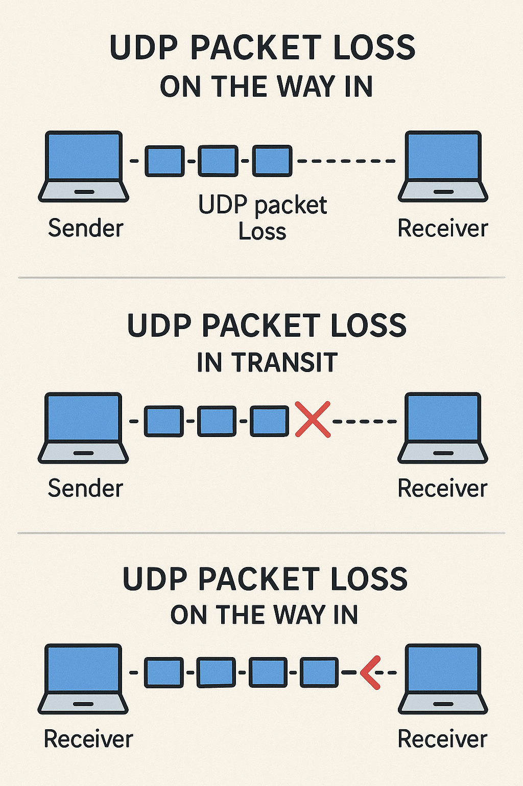

**Mất gói UDP** (UDP packet loss) xảy ra khi các datagram gửi đi không tới được đích, tạo ra những "lỗ hổng" trong dữ liệu truyền.

UDP không có cơ chế xác nhận đã nhận gói. Khác với TCP (bảo đảm toàn bộ dữ liệu tới nơi và tự truyền lại gói bị mất), UDP gửi gói đi mà không chờ ACK. Gói đã mất là mất hẳn.

Gói UDP có thể bị mất ở ba chỗ:

| Vị trí | Nguyên nhân |
|--------|-------------|
| **Chiều đi** (on the way out) | Ứng dụng gửi rất nhiều gói. Mỗi socket UDP có một bộ đệm gửi, nhân Linux cố đẩy gói ra càng nhanh càng tốt. Nếu card mạng chậm hoặc quá tải, không gửi kịp tốc độ đưa gói vào hàng đợi, hàng đợi tràn và gói bị bỏ |
| **Trên đường truyền** (in transit) | Tắc nghẽn mạng, lỗi định tuyến hoặc các yếu tố khác khiến gói không tới đích |
| **Chiều đến** (on the way in) | Gói tới máy nhận và được đưa vào bộ đệm nhận của socket. Nếu bộ đệm đầy hoặc quá nhỏ (ứng dụng đọc không kịp), gói mới đến bị bỏ |

Kích thước bộ đệm nhận quyết định số gói có thể chứa cùng lúc mà không bị mất. Xem cách kiểm tra và điều chỉnh ở [Phần 9.2](#bộ-đệm-nhận-của-socket-udp) và trang man `socket(7)`.

---

## Phần 10. Tùy chọn socket: `getsockopt` / `setsockopt`, `fcntl`

### 10.1. `getsockopt()` và `setsockopt()`

Hai hàm dùng để đọc và thay đổi các tùy chọn (option) của một socket.

```c
#include <sys/socket.h>

int getsockopt(int sockfd, int level, int optname,
               void *optval, socklen_t *optlen);

int setsockopt(int sockfd, int level, int optname,
               const void *optval, socklen_t optlen);
```

| Hàm | Chức năng |
|-----|-----------|
| `getsockopt()` | Lấy giá trị hiện tại của option |
| `setsockopt()` | Đặt giá trị mới cho option |

**Trả về:** `0` nếu thành công, `-1` nếu lỗi (và đặt `errno`).

**Ý nghĩa các tham số:**

| Tham số | Ý nghĩa |
|---------|---------|
| `sockfd` | Descriptor của socket cần đọc/đặt option |
| `level` | Tầng chứa option: `SOL_SOCKET` (chung cho mọi socket), `IPPROTO_IP` (của IPv4), `IPPROTO_TCP` (riêng của TCP) |
| `optname` | Tên option, ví dụ `SO_KEEPALIVE`, `SO_RCVTIMEO` |
| `optval` | Con trỏ tới vùng nhớ chứa giá trị option. Với `setsockopt()` là giá trị cần đặt; với `getsockopt()` là nơi nhân ghi kết quả |
| `optlen` | Kích thước vùng `optval`. `setsockopt()` nhận giá trị; `getsockopt()` nhận con trỏ vì nhân ghi lại kích thước thực tế (tham số giá trị–kết quả) |

### 10.2. Một số option thường gặp

| Level | Option | Ý nghĩa |
|-------|--------|---------|
| `SOL_SOCKET` | `SO_REUSEADDR` | Cho phép `bind()` vào địa chỉ/cổng đang ở trạng thái `TIME_WAIT`. Thường đặt cho socket lắng nghe của server, trước `bind()` |
| `SOL_SOCKET` | `SO_KEEPALIVE` | Gửi gói thăm dò định kỳ để phát hiện bên kia đã chết (xem [trường hợp 1b](#trường-hợp-1-read-khi-bên-kia-mất-mạng)) |
| `SOL_SOCKET` | `SO_RCVTIMEO` / `SO_SNDTIMEO` | Thời gian chờ tối đa của `read()` / `write()`; quá thời gian trả về lỗi `EAGAIN` / `EWOULDBLOCK` |
| `SOL_SOCKET` | `SO_RCVBUF` / `SO_SNDBUF` | Kích thước bộ đệm nhận / gửi |
| `SOL_SOCKET` | `SO_ERROR` | Chỉ đọc (chỉ dùng với `getsockopt()`): lấy mã lỗi đang chờ xử lý trên socket rồi xóa nó |

### 10.3. Ví dụ

Bật keepalive cho socket:

```c
int on = 1;
if (setsockopt(sockfd, SOL_SOCKET, SO_KEEPALIVE, &on, sizeof(on)) < 0) {
    perror("setsockopt SO_KEEPALIVE");
}
```

Đặt timeout 5 giây cho `read()`:

```c
struct timeval tv = { .tv_sec = 5, .tv_usec = 0 };
setsockopt(sockfd, SOL_SOCKET, SO_RCVTIMEO, &tv, sizeof(tv));
```

Đọc kích thước bộ đệm nhận hiện tại:

```c
int rcvbuf;
socklen_t len = sizeof(rcvbuf);
if (getsockopt(sockfd, SOL_SOCKET, SO_RCVBUF, &rcvbuf, &len) == 0) {
    printf("SO_RCVBUF = %d\n", rcvbuf);
}
```

### 10.4. `fcntl()`

`fcntl()` là system call dùng để đọc hoặc thay đổi các thuộc tính (file status flags) của một file descriptor. Vì socket cũng là file descriptor, `fcntl()` thường được dùng để thay đổi cách socket hoạt động.

```c
#include <fcntl.h>

int fcntl(int fd, int cmd, ... /* int arg */);
```

| Cách dùng | Ý nghĩa |
|-----------|---------|
| `F_GETFL` | Đọc các flag hiện tại của socket |
| `F_SETFL` + `O_NONBLOCK` | Đặt socket sang chế độ non-blocking |
| `F_SETFL` + `O_ASYNC` | Đặt socket sang chế độ signal-driven I/O |
| `F_SETOWN` | Chỉ định tiến trình / nhóm tiến trình nhận `SIGIO` / `SIGURG` |

Ví dụ: đặt TCP socket sang chế độ non-blocking:

```c
int flags = fcntl(sockfd, F_GETFL, 0);
fcntl(sockfd, F_SETFL, flags | O_NONBLOCK);
```

Phải đọc flag cũ rồi OR thêm `O_NONBLOCK`; nếu gọi thẳng `F_SETFL` với `O_NONBLOCK` sẽ xóa mất các flag khác.

Khi đó `read(sockfd, buf, sizeof(buf))` không còn block vô thời hạn: nếu chưa có dữ liệu, nó trả về `-1` ngay với `errno = EAGAIN` / `EWOULDBLOCK`.
